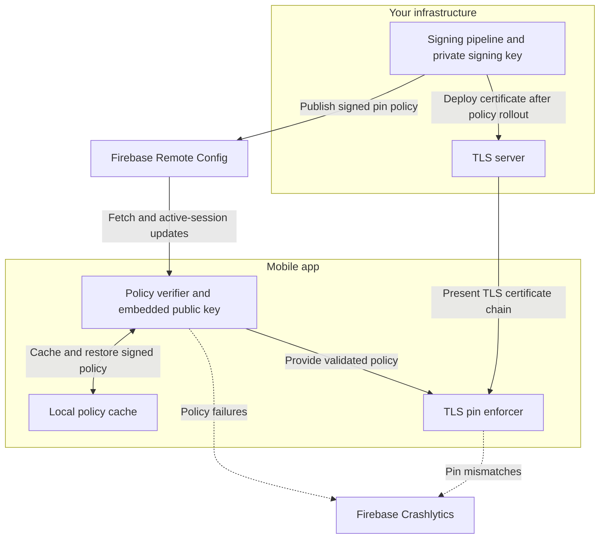

The [CA/Browser Forum has voted](https://cabforum.org/2025/04/11/ballot-sc081v3-introduce-schedule-of-reducing-validity-and-data-reuse-periods/) to reduce the maximum validity of publicly trusted TLS server certificates to 47 days by March 2029. The reduction is phased:

For backend teams, this is mostly an automation problem - renew more often, automate the pipeline, done. For mobile teams using certificate pinning, it's also a coordination problem: apps may stay installed and inactive for months, and a failed rotation can interrupt token exchange, MFA enrolment, or credential issuance. [DigiCert has a good summary](https://www.digicert.com/blog/tls-certificate-lifetimes-will-officially-reduce-to-47-days) of what the change means in practice.

## Why hardcoded pins struggle to keep up

SPKI (Subject Public Key Info) pinning - the kind `OkHttp`'s `CertificatePinner` uses - pins the *public key*, not the certificate itself. So a renewal doesn't break the pin, as long as the key pair doesn't change. The problem is that shorter certificate lifetimes means more frequent renewals, and where each renewal also rotates the key, you need the app to recognise the new key before the server switches to it. The [OWASP Mobile Security Testing Guide](https://mas.owasp.org/MASTG/knowledge/android/MASVS-NETWORK/MASTG-KNOW-0015) covers the different pinning approaches in detail.

With hardcoded pins, the configuration lives directly in the binary:

```kotlin
val client = OkHttpClient.Builder()
    .certificatePinner(
        CertificatePinner.Builder()
            .add("api.example.com", "sha256/AAAAAAAAAAAAAAAAAAAAAAAAAAAAAAAAAAAAAAAAAAA=") // current
            .add("api.example.com", "sha256/BBBBBBBBBBBBBBBBBBBBBBBBBBBBBBBBBBBBBBBBBBB=") // backup
            .build()
    )
    .build()
```

When the server rotates to a new key, those constants have to change - which means a new build and a new release.

At 47-day lifetimes with a new key per renewal, that's roughly eight key transitions per year - more if certificates are renewed before expiry. Each transition that wasn't provisioned in advance requires an app update, followed by the wait for users to install it.

| Certificate validity | Approximate key transitions/year |
|---|---:|
| 398 days | ~1 |
| 200 days | ~2 |
| 100 days | ~4 |
| 47 days | ~8 |

Backup pins and pre-provisioned keys can reduce the need for individual releases. But the underlying challenge remains: the server's key lifecycle has to stay compatible with your installed client population, including during emergency replacements.

## Can you just reuse the same key?

It's tempting. If the SPKI hash only depends on the public key, and shorter certificate lifetimes don't mandate new keys, you could renew with the same key pair each time and your hardcoded pin would never need to change.

Technically, yes - but there is a few things worth thinking through first:

- Certificate lifetime and key lifetime protect different things. Expiry ends the validity of one certificate; a stolen key can still be used in new certificates until you rotate it.
- Revoking one certificate doesn't makes a compromised key safe to reuse.
- Emergency rotation still needs a client-side strategy. A hardcoded-pin deployment needs a usable backup pin or an app update to recover.

Key reuse doesn't eliminate the benefits of shorter certificate lifetimes - it just makes key lifetime a separate decision you have to manage explicitly.

## Certificate Transparency is a complementary control, not a replacement

CT provides detection through public audit logs - a fraudulent certificate can still be logged and pass CT checks. See [RFC 9162](https://www.rfc-editor.org/info/rfc9162/) for the full specification. [Android's network security configuration](https://developer.android.com/privacy-and-security/security-config) supports per-domain CT settings; Android 17 (API 37) enables it by default, API 36 requires opt-in, and API 35 and earlier have no native support.

Pinning blocks connections to unexpected keys before CT monitoring can act, but offers no protection once the key itself is compromised. Neither control is sufficient on its own - layering both narrows the attack surface.

## The proposed solution at a glance

The idea is to **update the expected server keys without shipping a new app**. A *pin policy* is a signed JWT that tells the app which public-key hashes (`K_current` and `K_next`) to accept for specified hosts, and whether to enforce them. `K_current` is the hash of the key the server is using now; `K_next` is the hash of the key it will switch to at the next rotation. Carrying both in the policy means the app is never caught off-guard mid-transition.

There are four main parts:

- **Your signing pipeline creates the policy.** During certificate renewal or key rotation, it computes the relevant SPKI hashes and packages both pins into a signed JWT. The private signing key stays in your infrastructure. The pipeline publishes the policy before deploying the new certificate.
- **Firebase Remote Config delivers the policy.** The app fetches the signed JWT while foregrounded and can receive updates during an active session. Firebase transports the policy; it doesn't decide which pins to trust.
- **The app verifies, caches, and enforces the policy.** An embedded public key lets the app verify who signed the JWT. After checking it's validity and version, the app caches it for future starts and compares the server's SPKI hash against the accepted pins before sending application data.
- **Firebase Crashlytics provides operational visibility.** Every policy failure and pin mismatch fires a custom event so your on-call channel has actionable signal.

A local cache lets the app restore its last valid policy on cold start. *Fail-open* applies when no valid policy can be loaded at all - in that case the app allows the connection and falls back to standard TLS validation. This is a deliberate trade-off: availability takes priority over the additional pin check when the policy pipeline itself breaks down.



*The app initiates the TLS connection to the server; application traffic does not pass through Firebase.*

A few things worth calling out about the design:

- The policy-signing key and the server's TLS key are separate keys. The embedded public key authenticates policy updates; the hashes inside the policy identify acceptable TLS keys.
- Fail-open applies only to the additional pin check. Standard certificate chain, hostname, and CT checks remain required regardless.
- If a newly fetched policy is invalid, the app keeps its previous policy while it remains valid.
- `enforce: false` suspends connection blocking, but the app still records `PIN_MISMATCH` events. That's intentional - you keep observability even when enforcement is off.

## Delivering and operating the policy

### Firebase Remote Config as the transport

Firebase Remote Config provides cached values and conditions for staged rollout. Ordinary fetches default to a 12-hour minimum interval. Foreground real-time updates use an invalidation signal followed by an automatic fetch that bypasses that interval. Delivery still depends on connectivity and app activity, so measure adoption rather than assuming a fixed propagation time. See the [Firebase Remote Config documentation](https://firebase.google.com/docs/remote-config/android/real-time).

The policy is a compact ES256 JWT stored under a key like `tls_pin_policy`. Its protected header identifies `alg: ES256` and a trusted signing-key ID (`kid`). A compromised Firebase Remote Config project can suppress updates or replay an older valid token, but it can't forge a new policy.

### The JWT payload

```json
{
  "iat": 1791158400,
  "nbf": 1791158400,
  "exp": 1796342400,
  "aud": "example-mobile-app-production",
  "ver": 42,
  "enforce": true,
  "pins": {
    "*.example.com": ["sha256/CURRENT_PIN_BASE64...", "sha256/NEXT_PIN_BASE64..."]
  }
}
```

The timestamps and hashes above are illustrative. Here's what each field does:

- `ver` orders policy updates. Persist the highest accepted version and reject anything lower. Expiry alone doesn't stop replay of an older still-valid policy. Use `ver` as `policy_version` in telemetry.
- `iat`, `nbf`, and `exp` control the validity window. Validate it before activation and during long-running sessions. Retain future-dated policies for later rather than activating them early. For `exp`, a good starting point is two to three times your certificate lifetime - long enough to cover devices that miss a rotation cycle, short enough that a stale policy doesn't linger indefinitely.
- `aud` binds the policy to the intended app and environment. Validate it on the client - reject any policy whose `aud` doesn't match the expected value compiled into the app.
- `enforce` is a required boolean. `true` blocks connections on a pin mismatch; `false` suspends blocking but the app still records `PIN_MISMATCH` events so you retain observability. Publishing a newer signed policy with `false` is the kill switch - it takes effect once the app accepts the update.
- `pins` carries `K_current` and `K_next` to cover the transition on devices that receive the policy. Scope it to endpoints whose key lifecycle you control.

### Verifying the policy

Use a maintained JOSE library with an explicit algorithm allowlist and a trusted `kid`-to-key mapping. Follow [RFC 7515 §5.2](https://www.rfc-editor.org/rfc/rfc7515#section-5.2) for JWS validation: no payload claim should affect enforcement before all signature and claim checks pass.

Embed the verification public key in the app. Don't accept replacement keys from an unauthenticated key document - that lets whoever controls it redefine the trust anchor. Plan signing-key rotation via an app update or an authenticated key-introduction mechanism.

Store the raw signed JWT in an encrypted Room database and persist the accepted `ver` alongside it, so rollback protection survives restarts. Storing the raw JWT (rather than the decoded payload) means the signature can be re-verified on every cold start. Keep the private signing key in a non-exportable signing service - a compromised pipeline with signing access can authorise attacker-selected pins or disable enforcement.

### Reporting with Firebase Crashlytics

Record policy failures and pin mismatches as non-fatal diagnostics. Include `ver`, enforcement mode, app version, and a non-sensitive host identifier. Configure alert routing explicitly - recording an exception alone doesn't guarantee an on-call notification.

| Event | Meaning |
|---|---|
| `PIN_MISMATCH` | Server chain doesn't match the policy; blocked only when enforcement is enabled |
| `POLICY_EXPIRED` | Accepted policy has expired and no replacement is available; pin protection is absent |
| `SIGNATURE_INVALID` | Signature verification failed; retain the previous valid policy if available |
| `POLICY_INVALID` | Malformed JWT, unsupported algorithm, unknown key, or invalid claims |
| `POLICY_ROLLBACK_REJECTED` | Incoming version is older than the highest accepted version |
| `REMOTE_CONFIG_EMPTY` | Expected value is absent despite a previously configured policy |

`PIN_MISMATCH` warrants investigation - it could be an attack or a deployment error. `POLICY_EXPIRED` means pin protection is absent; a stale but still-valid policy can cause connection failures instead.

### Getting the rotation timing right

The step people get wrong most often are the ordering. Here's the correct sequence:

1. Stage the new certificate and compute its SPKI hash (`K_next`). You can extract it with: `openssl x509 -in cert.pem -pubkey -noout | openssl pkey -pubin -outform der | openssl dgst -sha256 -binary | base64`
2. Sign and publish a new JWT containing both `K_current` and `K_next`.
3. Wait for the policy to reach the overwhelming majority of active devices. Use `policy_version` (the JWT's `ver`) in telemetry to observe adoption - don't guess.
4. Deploy the new certificate. `K_next` becomes `K_current`.
5. Retire the old pin in a later policy once it's no longer needed.

If the new certificate goes live before the new policy reaches devices, devices still on the old policy will see a pin mismatch. That's the signal that should mean "something suspicious is happening" - once it fires as routine noise, it loses its value.

### Recovering devices with stale policies

A valid policy isn't necessarily a current one. A device may cache pins A and B, miss several rotations, and come back when the server is already on C. Its policy can still pass signature and expiry checks while rejecting the legitimate server.

To handle this, refresh the policy on foreground entry before sensitive API work. If a request encounters stale pins, try a policy refresh and re-evaluate before retrying. A mismatch is never permission to bypass enforcement. If the refresh isn't available, the existing policy governs until it expires or a valid replacement arrives.

A longer policy lifetime can preserve stale restrictions; expiry deliberately removes pin protection. The kill switch has the same delivery dependency as any other policy update - it can't help a device that can't reach Firebase Remote Config.

## Rolling out enforcement safely

Run the phases below once to establish the pipeline. After that, routine rotations follow the publish–observe–deploy sequence. Revisit the validation steps if you make material changes to signing, delivery, host scope, or the app's networking implementation.

**Phase 1 - Observation**

Publish policies with `enforce: false`. Validate signatures and record mismatches without blocking connections. Run several representative rotations, including emergency replacement and devices returning after a long absence. You don't need to wait for 2029 to test this.

Check that policy adoption is measurable, current/next pin coverage is correct, the cache restores correctly, and reporting is reaching the right people.

**Phase 2 - Enforce for a limited rollout**

Publish `enforce: true` to a controlled device cohort and expand only after seeing acceptable behaviour. Each distinct policy revision needs a new `ver`.

Test the kill switch by publishing a newer `enforce: false` policy - it suspends enforcement once received. Fail-open is different: it applies when no valid policy is available at all. Neither mechanism works if the device can't receive the update.

**Phase 3 - Enforce broadly**

Expand to the full production population. The decision rule is the same as Phase 2: block a mismatch when a valid policy have `enforce: true`. The only thing changing from Phase 2 is rollout scope.

Keep the kill switch and monitor both blocked requests and loss of pin coverage.

One scoping point worth calling out: the HTTP client policy you configure in the app applies to your own network calls. It doesn't automatically extend to browser-mediated flows like OAuth authorization - those run in a system browser or Custom Tab outside your app's networking stack. If those flows involve pinned hosts, they need their own enforcement strategy.

## Summary

Shorter certificate lifetimes mean more frequent renewals. Where renewals also rotate keys, you need a reliable way to keep accepted pins in step with server deployments without forcing an app release each time.

CT is the baseline - it adds issuance transparency where the platform supports it. Pinning adds an additional restriction on acceptable keys for teams whose threat model warrants it. Signed runtime policies let you deliver those pin updates independently of your release cycle, but they come with their own requirements: version checks, defined failure behaviour, and a way to recover from stale policies.

If you're using pinning today, I'd recommend testing both your normal rotation process and what happens when a device misses one. Those are the two scenarios that will matter most as certificate lifetimes shorten.

---


